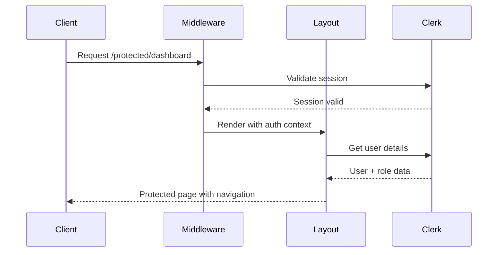
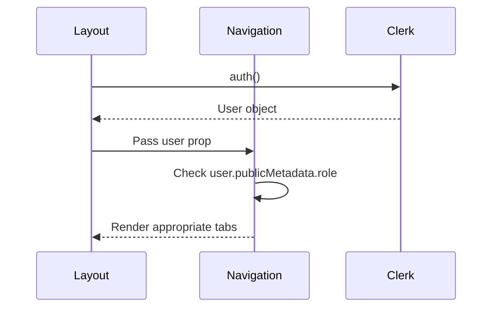

# Protected Area Shell - API Contracts

## Overview

The Protected Area Shell feature primarily relies on Server Components and does not expose
traditional REST APIs. Instead, it defines component contracts and authentication flow interfaces.

## Authentication Flow Contract

### Server Component Authentication

```typescript
// Contract: Protected layout authentication check
interface AuthenticationContract {
  input: {
    request: NextRequest; // Incoming request
    pathname: string; // Route being accessed
  };

  output: {
    user: ClerkUser | null; // Authenticated user or null
    isAuthenticated: boolean; // Authentication status
    redirectUrl?: string; // Redirect URL if unauthenticated
  };

  errors: {
    UNAUTHORIZED: 'User not authenticated';
    FORBIDDEN: 'User lacks required permissions';
    AUTH_ERROR: 'Authentication service error';
  };
}
```

### Role-based Access Contract

```typescript
// Contract: Role permission validation
interface RolePermissionContract {
  input: {
    user: ClerkUser; // Authenticated user
    requestedSection: NavigationSection; // Section being accessed
  };

  output: {
    hasAccess: boolean; // Permission granted
    allowedSections: NavigationSection[]; // All allowed sections
  };

  errors: {
    INVALID_ROLE: 'Unknown role provided';
    SECTION_FORBIDDEN: 'Section not accessible for user role';
  };
}
```

## Component Contracts

### Protected Layout Component

```typescript
// Contract: Main protected layout component
interface ProtectedLayoutContract {
  props: {
    children: React.ReactNode; // Page content
    title?: string; // Optional page title
  };

  behavior: {
    // Server-side authentication check on every render
    // Redirect to sign-in if unauthenticated
    // Render navigation based on user role
    // Provide sign-out functionality
  };

  dependencies: {
    auth: 'Clerk auth() helper';
    redirect: 'Next.js redirect()';
    navigation: 'ProtectedNavigation component';
  };
}
```

### Navigation Component Contract

```typescript
// Contract: Role-based navigation component
interface ProtectedNavigationContract {
  props: {
    user: ClerkUser; // Authenticated user for role determination
    currentPath?: string; // Current pathname for active state
  };

  behavior: {
    // Render tabs based on user role
    // Highlight active section
    // Handle tab switching
    // Show user info and sign-out option
  };

  rendering: {
    userRole: ['dashboard', 'courses'];
    adminRole: ['dashboard', 'courses', 'admin'];
  };
}
```

## Middleware Contract

### Route Protection Middleware

```typescript
// Contract: Clerk middleware configuration
interface MiddlewareContract {
  input: {
    request: NextRequest; // Incoming request
    auth: AuthObject; // Clerk auth object
  };

  behavior: {
    // Check if route requires protection
    // Authenticate user for protected routes
    // Allow public routes without auth
    // Handle auth redirects
  };

  configuration: {
    protectedRoutes: ['/protected(.*)'];
    publicRoutes: ['/sign-in', '/sign-up', '/'];
    afterAuth: 'Custom auth handling logic';
  };
}
```

## Data Flow Contracts

### User Session Flow



### Role-based Navigation Flow



## Error Handling Contracts

### Authentication Errors

```typescript
interface AuthErrorContract {
  scenarios: {
    UNAUTHENTICATED: {
      trigger: 'No valid session';
      response: 'Redirect to /sign-in';
      userExperience: 'Seamless redirect without error flash';
    };

    SESSION_EXPIRED: {
      trigger: 'Clerk session expired';
      response: 'Automatic refresh or redirect';
      userExperience: 'Graceful re-authentication';
    };

    AUTH_SERVICE_DOWN: {
      trigger: 'Clerk service unavailable';
      response: 'Show error page';
      userExperience: 'Clear error message with retry option';
    };
  };
}
```

### Permission Errors

```typescript
interface PermissionErrorContract {
  scenarios: {
    INSUFFICIENT_ROLE: {
      trigger: 'User role lacks required permission';
      response: 'Show access denied message';
      userExperience: 'Clear explanation of required role';
    };

    UNKNOWN_ROLE: {
      trigger: 'User has undefined or invalid role';
      response: 'Default to user role permissions';
      userExperience: 'Graceful degradation to basic access';
    };
  };
}
```

## Performance Contracts

### Server-Side Rendering Requirements

```typescript
interface SSRPerformanceContract {
  requirements: {
    authCheckLatency: '<50ms'; // Maximum auth() call time
    renderTime: '<200ms'; // Total TTFB including auth
    caching: 'No auth state caching (security)';
    fallback: 'Immediate redirect for unauthenticated';
  };
}
```

## Security Contracts

### Authentication Security

```typescript
interface SecurityContract {
  requirements: {
    sessionValidation: 'Server-side only';
    roleExposure: 'No client-side role information';
    redirectSecurity: 'Secure redirect handling';
    csrfProtection: 'Clerk handled CSRF protection';
  };

  prohibited: {
    clientSideAuth: 'No useAuth() or client components for auth checks';
    roleInUrl: 'No role information in URLs or client state';
    unsecuredFallbacks: 'No client-side permission fallbacks';
  };
}
```

## Testing Contracts

### E2E Test Requirements

```typescript
interface E2ETestContract {
  scenarios: {
    signInFlow: 'Sign in → access protected area → navigate tabs';
    roleBasedAccess: 'Verify admin sees admin tab, user does not';
    signOutFlow: 'Sign out → redirect to public area';
    directUrlAccess: 'Attempt direct protected URL while unauthenticated';
  };
}
```

### Unit Test Requirements

```typescript
interface UnitTestContract {
  components: {
    ProtectedLayout: 'Auth check behavior, error handling';
    ProtectedNavigation: 'Role-based rendering, tab switching';
  };

  utilities: {
    rolePermissions: 'Permission checking logic';
    authHelpers: 'Authentication utility functions';
  };
}
```

**Status**: ✅ API Contracts Complete - Server Component and authentication flow contracts defined
