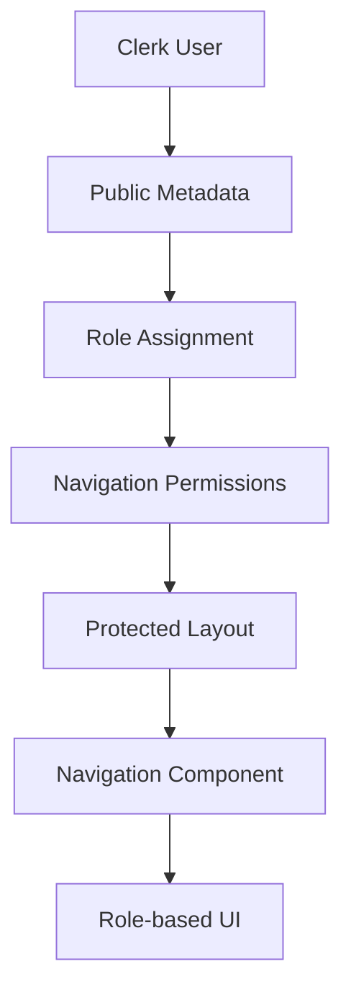

# Data Model: Protected Area Shell

## Overview

The Protected Area Shell feature primarily leverages Clerk's authentication system and user metadata
for role management. Minimal additional data modeling is required as this feature focuses on UI/UX
structure rather than data persistence.

## Authentication Entities

### User Session (Clerk Managed)

```typescript
interface ClerkUser {
  id: string; // Clerk user ID
  emailAddress: string; // Primary email
  firstName?: string; // Optional given name
  lastName?: string; // Optional family name
  publicMetadata: {
    // Clerk public metadata
    role?: 'user' | 'admin'; // Role assignment
  };
  privateMetadata?: Record<string, any>; // Clerk private metadata
}
```

**Validation Rules**:

- `id`: Required, unique identifier from Clerk
- `emailAddress`: Required, valid email format
- `role`: Defaults to 'user' if not specified
- Role must be one of: 'user' | 'admin'

**State Transitions**:

- Initial signup → role = 'user' (default)
- Admin promotion → role = 'admin' (manual process)
- Role demotion → role = 'user' (manual process)

### Navigation Permission

```typescript
interface NavigationPermission {
  role: 'user' | 'admin';
  allowedSections: NavigationSection[];
}

type NavigationSection = 'dashboard' | 'courses' | 'admin';

const ROLE_PERMISSIONS: Record<string, NavigationSection[]> = {
  user: ['dashboard', 'courses'],
  admin: ['dashboard', 'courses', 'admin'],
};
```

**Validation Rules**:

- All roles must include 'dashboard'
- 'admin' section only accessible to admin role
- Unknown roles default to 'user' permissions

## UI State Entities

### Protected Layout State

```typescript
interface ProtectedLayoutProps {
  user: ClerkUser; // Authenticated user
  currentSection?: NavigationSection; // Active navigation tab
  children: React.ReactNode; // Page content
}

interface NavigationState {
  activeTab: NavigationSection;
  availableTabs: NavigationSection[];
  isSigningOut: boolean;
}
```

**Validation Rules**:

- `user`: Must be authenticated (non-null)
- `currentSection`: Must be in user's allowed sections
- `activeTab`: Must exist in availableTabs array

## Integration Points

### Clerk Integration

**Data Flow**:

1. Clerk handles authentication and session management
2. User metadata stored in Clerk's system
3. Role information retrieved via `auth()` helper
4. No additional database storage required for this feature

**Role Management**:

- Roles stored in Clerk's `publicMetadata.role` field
- Default role assignment on user creation
- Role updates via Clerk Dashboard or API

### Future Database Integration

**Extensibility Considerations**:

- User profile data can be stored in Prisma schema
- Role permissions can be expanded to granular permissions
- Audit logging for role changes can be added

```typescript
// Future Prisma schema extension (not implemented in this feature)
model UserProfile {
  id          String   @id @default(cuid())
  clerkUserId String   @unique
  role        Role     @default(USER)
  createdAt   DateTime @default(now())
  updatedAt   DateTime @updatedAt
}

enum Role {
  USER
  ADMIN
}
```

## Relationships



## Data Security

### Authentication Security

- Server-side session validation via `auth()` helper
- No client-side role information exposure
- Secure role checks in Server Components

### Role Authorization

- Role validation on every protected route access
- Server-side permission checks before rendering
- Fallback to 'user' role for undefined roles

## Performance Considerations

### Data Access Patterns

- Single `auth()` call per protected page request
- Role information cached within request lifecycle
- No additional database queries for basic role checks

### Optimization Strategies

- Server Component rendering eliminates client-side auth state
- Minimal data transfer (role info only)
- Static navigation structure based on role

## Migration Strategy

### Current State

- No existing user data to migrate
- Clean implementation with Clerk from start

### Future Considerations

- Role data can be migrated to Prisma if needed
- User profile expansion without breaking changes
- Gradual enhancement of role system complexity

**Status**: ✅ Data Model Complete - Minimal entities for authentication-focused feature
