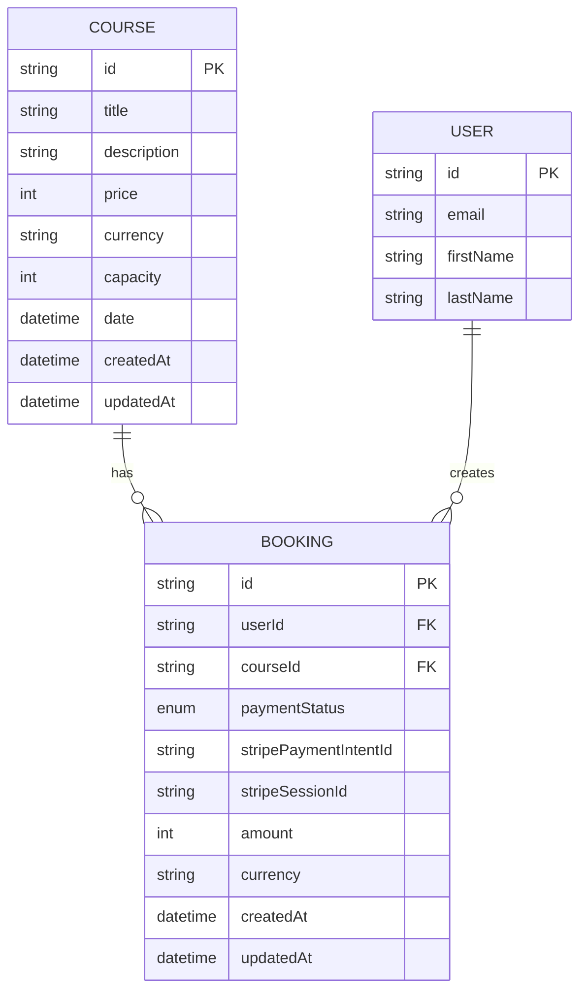
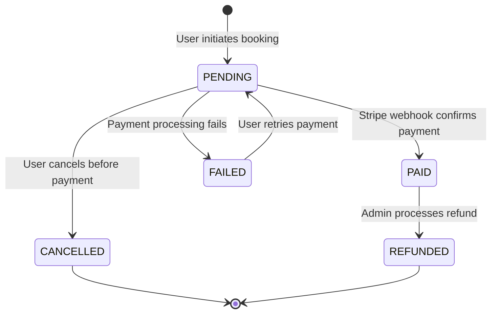

# Data Model: Booking and Payment

## Prisma Schema Extensions

### Course Model

```prisma
model Course {
  id          String   @id @default(cuid())
  title       String
  description String?
  price       Int      // Price in cents
  currency    String   @default("USD")
  capacity    Int?     // Optional capacity limit
  date        DateTime? // Optional scheduled date
  createdAt   DateTime @default(now())
  updatedAt   DateTime @updatedAt

  // Relations
  bookings    Booking[]

  @@map("courses")
}
```

### Booking Model

```prisma
model Booking {
  id                    String        @id @default(cuid())
  userId                String        // Clerk user ID
  courseId              String
  paymentStatus         PaymentStatus @default(PENDING)
  stripePaymentIntentId String?       // Stripe payment intent ID
  stripeSessionId       String?       // Stripe checkout session ID
  amount                Int           // Amount paid in cents
  currency              String        @default("USD")
  createdAt             DateTime      @default(now())
  updatedAt             DateTime      @updatedAt

  // Relations
  course                Course        @relation(fields: [courseId], references: [id], onDelete: Cascade)

  // Constraints
  @@unique([userId, courseId]) // Prevent duplicate bookings
  @@map("bookings")
}

enum PaymentStatus {
  PENDING
  PAID
  FAILED
  CANCELLED
  REFUNDED
}
```

## Entity Relationships



## Data Flow & State Transitions

### Booking Lifecycle



### Payment Flow Data

1. **Booking Creation**:
   - Status: `PENDING`
   - Stripe session created
   - `stripeSessionId` stored

2. **Payment Processing**:
   - User completes Stripe Checkout
   - Webhook receives `checkout.session.completed`
   - Status updated to `PAID`
   - `stripePaymentIntentId` stored

3. **Error Handling**:
   - Payment failures → Status: `FAILED`
   - User can retry → New Stripe session
   - Cancellations → Status: `CANCELLED`

## Validation Rules

### Course Validation

- `title`: Required, 1-200 characters
- `price`: Required, positive integer (cents)
- `currency`: Must be valid ISO currency code
- `capacity`: Optional, positive integer if provided
- `date`: Optional, future date if provided

### Booking Validation

- `userId`: Required, valid Clerk user ID
- `courseId`: Required, must reference existing course
- `amount`: Must match course price at booking time
- `paymentStatus`: Required, valid enum value
- Unique constraint: One booking per user per course

## Security Considerations

### Data Protection

- **No Card Data**: Never store payment card information
- **Minimal Stripe Data**: Only store necessary payment references
- **User Isolation**: Users can only access their own bookings
- **Audit Trail**: All payment status changes logged with timestamps

### Access Control

- **Course Data**: Read-only for booking purposes
- **Booking Data**: User can only view/create their own bookings
- **Payment Data**: Stripe handles sensitive operations
- **Admin Access**: Separate admin interface for course management

## Migration Strategy

### Phase 1: Core Tables

```sql
-- Create courses table
CREATE TABLE courses (
  id TEXT PRIMARY KEY,
  title TEXT NOT NULL,
  description TEXT,
  price INTEGER NOT NULL,
  currency TEXT DEFAULT 'USD',
  capacity INTEGER,
  date TIMESTAMP,
  created_at TIMESTAMP DEFAULT NOW(),
  updated_at TIMESTAMP DEFAULT NOW()
);

-- Create payment status enum
CREATE TYPE payment_status AS ENUM ('PENDING', 'PAID', 'FAILED', 'CANCELLED', 'REFUNDED');

-- Create bookings table
CREATE TABLE bookings (
  id TEXT PRIMARY KEY,
  user_id TEXT NOT NULL,
  course_id TEXT NOT NULL REFERENCES courses(id) ON DELETE CASCADE,
  payment_status payment_status DEFAULT 'PENDING',
  stripe_payment_intent_id TEXT,
  stripe_session_id TEXT,
  amount INTEGER NOT NULL,
  currency TEXT DEFAULT 'USD',
  created_at TIMESTAMP DEFAULT NOW(),
  updated_at TIMESTAMP DEFAULT NOW(),
  UNIQUE(user_id, course_id)
);
```

### Phase 2: Indexes and Optimization

```sql
-- Performance indexes
CREATE INDEX idx_bookings_user_id ON bookings(user_id);
CREATE INDEX idx_bookings_course_id ON bookings(course_id);
CREATE INDEX idx_bookings_payment_status ON bookings(payment_status);
CREATE INDEX idx_bookings_stripe_session ON bookings(stripe_session_id);

-- Course search indexes
CREATE INDEX idx_courses_price ON courses(price);
CREATE INDEX idx_courses_date ON courses(date);
```

## Sample Data

### Example Courses

```typescript
const sampleCourses = [
  {
    id: 'course_1',
    title: 'Introduction to TypeScript',
    description: 'Learn TypeScript fundamentals with hands-on exercises',
    price: 9900, // $99.00
    currency: 'USD',
    capacity: 50,
    date: new Date('2025-11-01T10:00:00Z'),
  },
  {
    id: 'course_2',
    title: 'Advanced React Patterns',
    description: 'Master advanced React concepts and design patterns',
    price: 14900, // $149.00
    currency: 'USD',
    capacity: 30,
    date: new Date('2025-11-15T14:00:00Z'),
  },
];
```

### Example Bookings

```typescript
const sampleBookings = [
  {
    id: 'booking_1',
    userId: 'user_clerk_123',
    courseId: 'course_1',
    paymentStatus: 'PAID',
    stripePaymentIntentId: 'pi_stripe_123',
    stripeSessionId: 'cs_stripe_456',
    amount: 9900,
    currency: 'USD',
  },
];
```
